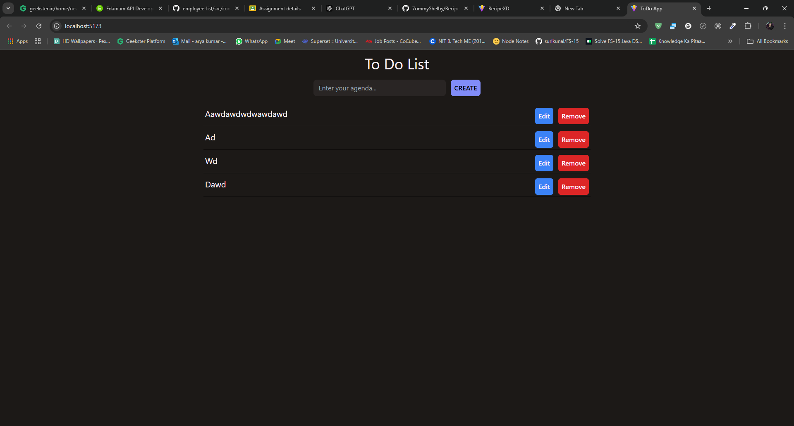

# Todo Application

A simple and responsive Todo application built using React.js. This application allows users to perform all CRUD operations—Create, Read, Update, and Delete—on their list of tasks.

## Table of Contents

- [Features](#features)
- [Screenshots](#screenshots)
- [Installation](#installation)
- [Usage](#usage)
- [Technologies Used](#technologies-used)
- [Contributing](#contributing)
- [License](#license)

## Features

- **Add New Todo**: Users can add new tasks to their list.
- **Edit Existing Todo**: Modify existing tasks.
- **Delete Todo**: Remove tasks from the list.
- **Mark Todo as Complete**: Mark tasks as complete or incomplete.
- **Responsive Design**: Fully responsive design for mobile, tablet, and desktop.


## Screenshots



## Installation

1. Clone this repository to your local machine:
    ```bash
    git clone https://github.com/7ommyShelby/Todo-CRUD.git
    ```

2. Navigate to the project folder:
    ```bash
    cd todo-app
    ```

3. Install the required dependencies:
    ```bash
    npm install
    ```

4. Start the development server:
    ```bash
    npm start
    ```

5. Open your browser and go to `http://localhost:5173` to view the application.

## Usage

- **Adding a Todo**: Type a task in the input field and press the "Add" button.
- **Editing a Todo**: Click on a task to edit its description.
- **Deleting a Todo**: Click the "Delete" button next to a task to remove it.


## Technologies Used

- **React.js**: Frontend JavaScript library for building user interfaces.
- **JavaScript (ES6+)**: Logic for handling state and events.
- **TAILWIND CSS**: Styling for the UI components.


## Contributing

Contributions are welcome! If you'd like to contribute, please fork the repository and create a pull request with your proposed changes.

1. Fork the Project
2. Create your Feature Branch (`git checkout -b feature/YourFeature`)
3. Commit your Changes (`git commit -m 'Add some feature'`)
4. Push to the Branch (`git push origin feature/YourFeature`)
5. Open a Pull Request

## License

This project is licensed under the MIT License. See the [LICENSE](LICENSE) file for details.


